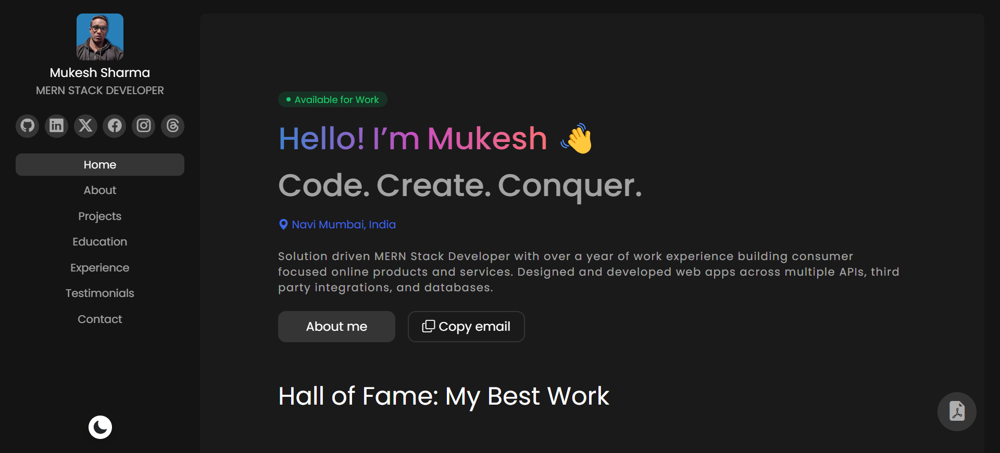

# Welcome to my Portfolio Website! 👋

## About Page:

In the About page of my portfolio website, you'll discover a comprehensive rundown of my technical proficiencies and expertise. My journey in web development has led me to specialize in the MERN (MongoDB, Express.js, React.js, Node.js) stack, empowering me to craft resilient and scalable web applications. Moreover, I possess adeptness in front-end technologies like HTML5, CSS3, and JavaScript, complemented by substantial experience in backend development, API integration, and database management. With an unwavering commitment to precision and a fervent dedication to delivering top-notch code, I'm primed to tackle any project with confidence.

## Projects Page:

Embark on a journey through the Projects page of my portfolio website to delve into the captivating web development endeavors I've undertaken. From immersive websites to dynamic web applications, each project serves as a testament to my ability to translate concepts into functional and aesthetically pleasing digital experiences. Explore the technologies employed, project objectives, and my contributions throughout the development lifecycle. Feel free to explore live demos or peruse the source code hosted on GitHub.

## Education Page:

Navigate to the Education page to uncover insights into my academic voyage and professional certifications. I've pursued a rigorous curriculum to cultivate a robust foundation in computer science and software engineering . My educational odyssey has furnished me with both theoretical knowledge and hands-on skills requisite for excelling in the field. I remain ardently committed to continuous self-improvement, ensuring I remain abreast of the latest industry trends and emerging technologies.

## Experience Page:

Explore the Experience page to delve deeper into my professional journey and accomplishments. My academic pursuit has been intertwined with practical experiences that have fortified my acumen in computer science and software engineering. These experiences have been pivotal in sculpting me into a proficient practitioner in the realm of web development. I persistently engage in self-directed learning endeavors to stay attuned to the dynamic landscape of technology.

## Testimonials Page:

Immerse yourself in the Testimonials page to glean insights from individuals who have witnessed my work firsthand. Colleagues, clients, and collaborators have graciously shared their perspectives, underscoring my dedication, ingenuity, and problem-solving prowess. Their testimonials encapsulate my unwavering commitment to delivering exceptional outcomes and fostering constructive professional relationships. Take a moment to peruse their narratives and ascertain how I can contribute to the realization of your projects.

## Contact Page:

If you're intrigued by the prospect of collaboration, have inquiries, or simply wish to connect, the Contact page offers various avenues to reach out. Whether you opt to complete the contact form, shoot me an email, or engage via my social media handles, I'm readily available to explore new opportunities, discuss potential ventures, or address any queries you may have. I prioritize transparent and expeditious communication, ensuring a seamless experience for prospective clients, collaborators, and employers.

Thank you for taking the time to explore my Portfolio Website. I trust that the information and examples presented here offer valuable insights into my skills and capabilities as a web developer. I eagerly anticipate the prospect of collaborating with you and transforming your ideas into reality!
